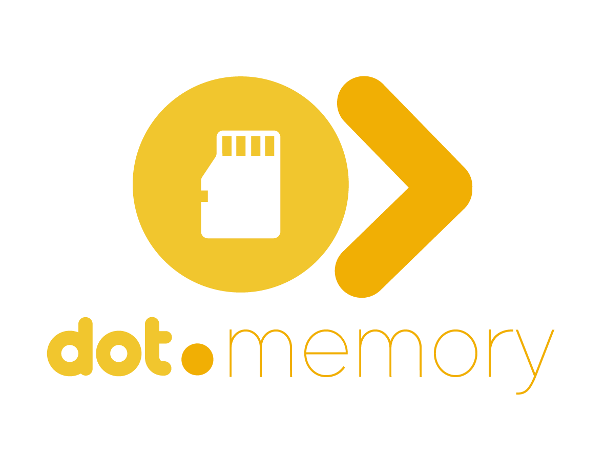

<div align="center">



<br /><br />

**Storage and retrieval telemetry for the Dot Ecosystem — stores content without reading it.**

<br />

   

<br /><br />

**Part of the Dot Ecosystem** &nbsp;·&nbsp; `memory.infodot.app`

</div>

---

## ⚠️ Status: unverified hand-authored scaffolding

This codebase was hand-authored in an environment **without PHP, Composer, or PostgreSQL**. No
migration has run, no test has executed, and no `composer install` has occurred. Every file here
is scaffolding written by careful reading and pattern-matching against a real, previously verified
sibling app (Dot.Billing) — not something that has been proven to boot. Treat this as a strong
first draft that needs a real `composer install && php artisan migrate && php artisan test` pass
before anyone trusts it. See the wiki's changelog for the same note in context.

## What is Dot.Memory?

Dot.Memory is the persistence substrate for the Dot Ecosystem: knowledge-graph storage, vector
indexes for semantic retrieval, and the audit trails every other platform's governance gates write
to. It is infrastructure, not a knowledge consumer.

The one rule that shapes everything in this repository: **Dot.Memory the infrastructure stores
knowledge without reading it; Dot.Memory the platform publishes only its own operational
telemetry** (latency, durability, integrity — never content). See `wiki.md` for the full
architecture blueprint this app follows.

## Domain model (this MVP)

A monitoring/observability app over shared, ecosystem-level storage infrastructure — not the
storage system itself, and not per-team (tenant key = the owning platform that published the
content, per `wiki.md` §7; Jetstream Teams here only gate human access to the dashboard):

| Model | Table | Represents |
|---|---|---|
| `StorageTier` | `storage_tiers` | hot / warm / cold, with latency targets |
| `Index` | `indexes` | graph / vector / audit-log indexes, keyed by id + version |
| `RetrievalClass` | `retrieval_classes` | the four named SLA contracts (`retr:agent-context:hot`, `retr:surface:hot`, `retr:audit:warm`, `retr:archive:cold`) |
| `RetrievalObservation` | `retrieval_observations` | aggregated latency/failure telemetry per class × time window |
| `DurabilityOutcome` | `durability_outcomes` | verified restore-test and integrity-check results |

**No model or migration in this app has a field capable of holding arbitrary tenant content.**
Every column is a number, boolean, enum/label, or timestamp — enforced structurally (see the
migration's doc comment and `tests/Unit/StoreWithoutReadingInvariantTest.php`, not just by
convention.

## Core features

- SLA dashboard — current attainment (p95/p99 vs. contract) per retrieval class
- Index inventory — type, version, tier, status, entry count per index
- Durability outcomes — recent restore-test and integrity-check results per tier
- Jetstream Teams shell (auth, profile, 2FA, API tokens) — gates dashboard access only; the
  telemetry itself is not team-scoped
- Ecosystem SSO (`EcosystemAuthController`) shared with the rest of the Dot Ecosystem
- Dark / light mode toggle, in-app notification bell

## Getting started (once PHP/Composer/Postgres are available)

```bash
composer install
cp .env.example .env
php artisan key:generate
php artisan migrate --seed
npm install && npm run build
php artisan serve
```

The seeder (`database/seeders/DatabaseSeeder.php`) populates realistic example telemetry matching
the SLA targets in `wiki.md` §5 (e.g. p95 ≤ 800ms for `retr:agent-context:hot`), including one
historical breach window mirroring the incident described in Dot.Brain's ingested view of this
platform.

## Related documents

- [`wiki.md`](wiki.md) — this platform's own architecture blueprint (authoritative for what
  Dot.Memory *is*)
- [Dot.Brain's ingested view](https://github.com/sakhilebhayi/Dot.Brain/blob/main/platforms/dot-memory.md)
  — integration mechanics, knowledge packs, worked round-trip
